# Poverty in Colorado

A study on homelessness in Denver, Colorado.

## Project Purpose
The past two or three decades have witnessed a startling rise in the number of Americans living in poverty. This complex issue has a multitude of contributing factors, but our team will zero in on five key areas to explore potential correlations: Income, poverty, employment, housing, and homelessness/hunger. While there may be a surface-level inclination to believe a strong "yes" exists between poverty and each of these factors, a more nuanced approach is required.  Before jumping to conclusions or perpetuating stereotypes, we must meticulously analyze the data and translate it into clear visualizations. It's crucial to remember that correlation does not imply causation. Just because two factors appear to be linked doesn't necessarily mean one causes the other. Through rigorous analysis and objective data exploration, we hope to paint a clearer picture of the multifaceted relationship between poverty and these specific areas of our society.

## Questions to be addressed
Our overarching question is "How did we get here"?

Poverty

Housing:
* Is income keeping pace with the average price of rent?
* Is there a correlation between the cost of rent, the value of home ownership, and the average monthly housing expense with a mortgage?
* Is there a correlation between the average year of homes built and the population of the five largest counties (by population) and the five smallest counties (by population)?

Employment:
* Is there a correlation between employed people over the age of 16 and unemployed people over the age of 16?
* Is there a correlation between median household income and per capita income?

Income

Homelessness

## Overview of data collection, cleanup and exploration process

## Approach taken to achieve goals

## Observation 1

## Housing Observation:
Is income keeping pace with the average price of rent?

The analysis of income trends compared to the average price of rent involved plotting data on median household income, the average cost of rent and utilities, and all data combined. This data was sourced from the U.S. Census, providing a comprehensive view of income and housing cost dynamics over time. Through visualizations and numerical analysis, we aimed to determine whether income growth is in line with the rise in average rent and utilities.

The findings from the analysis provide insights into the relationship between income and housing costs. By examining the plotted data, we can discern whether income levels are keeping pace with the increasing average price of rent and utilities. A consistent or increasing trend in income aligned with a similar pattern in rent and utilities would suggest that income is indeed keeping pace with housing costs. On the other hand, if the trend in housing costs outpaces income growth, it indicates potential challenges in housing affordability.

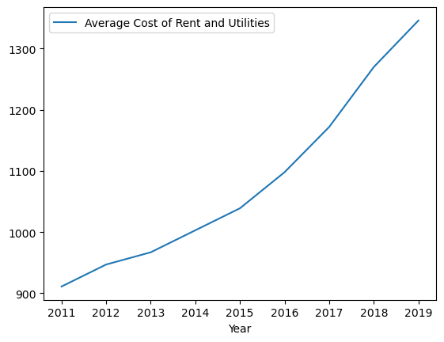
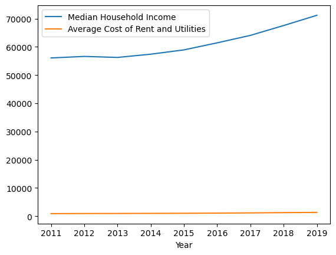

## Housing Observation: 
Is there a correlation between the cost of rent, the value of home ownership, and the average monthly housing expense with a mortgage?

To assess the correlation between the cost of rent, the value of home ownership, and the average monthly housing expense with a mortgage, data was gathered from the U.S. Census focusing on variables such as "Average Monthly Housing Expense with Mortgage," "Median Contract Rent," and "Average Value of Owner-occupied Home." The data was then processed using grouping and averaging the relevant variables by year. This approach allowed for a comprehensive analysis of trends over time and facilitated the examination of potential correlations between these housing-related metrics.

The analysis revealed interesting insights into the relationships between housing costs, home values, and mortgage expenses. There was a strong positive correlation between the cost of rent and average monthly housing expenses with a mortgage, indicating that as rental prices increase, so do mortgage expenses for homeowners. Additionally, a moderate positive correlation was observed between home values and average monthly housing expenses with a mortgage, suggesting that higher home values are associated with higher mortgage payments. These findings emphasize the interconnectedness of housing and homeownership expenses.

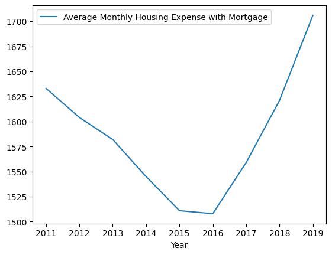
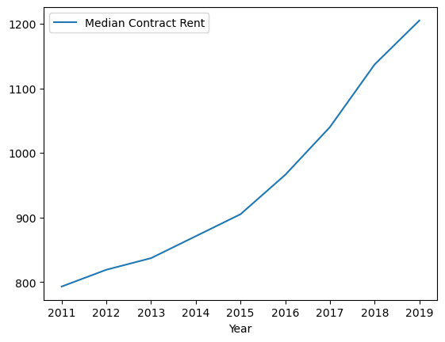
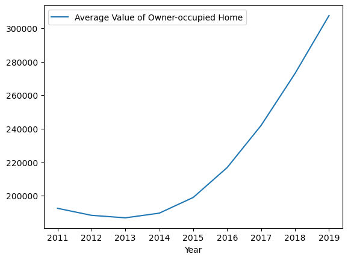
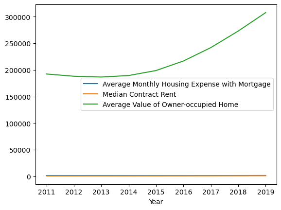

## Housing Observation:
Is there a correlation between the average year of homes built and the population of the five largest counties (by population) and the five smallest counties (by population)?

The analysis aimed to determine if there is a correlation between the average year of homes built and the population of the five largest counties and the five smallest counties, both categorized by population size. The data for this analysis was gathered from the U.S. Census, focusing on variables such as "Average Year Home Built," "Total Population," "County," and "Year." We were able to extract and group the data, separating it into urban and rural areas based on the counties' population sizes.

Upon analyzing the data, distinct trends were observed between the average year of homes built and the population of counties. In the five largest counties, there appeared to be a correlation between population size and newer home construction, indicated by a trend of decreasing average year of home construction as population size increased. Conversely, in the five smallest counties, there was a different trend, suggesting that smaller populations were associated with older homes on average. These findings highlight potential patterns in housing development and population distribution, which can be valuable for urban planning, real estate, and demographic studies.

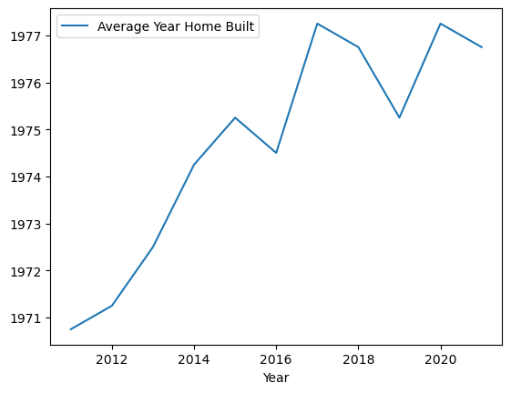
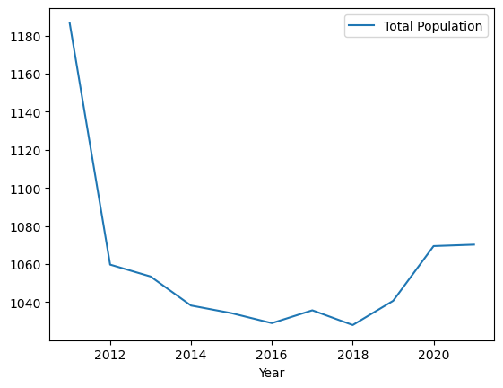
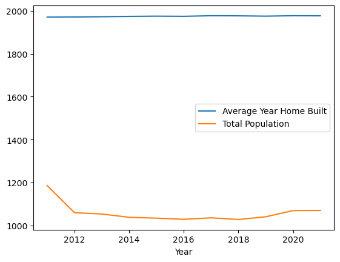

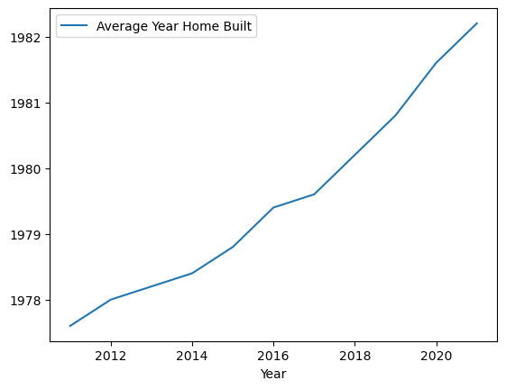
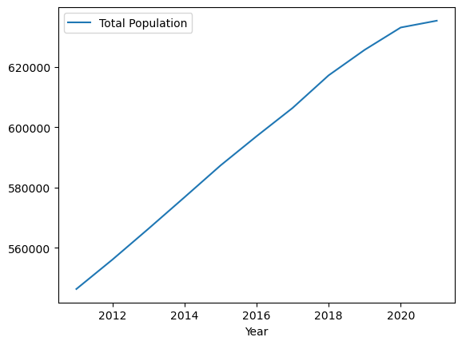
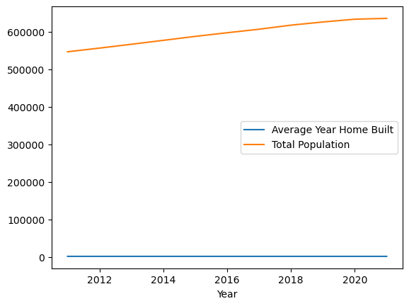

## Employment Observation:
Is there a correlation between employed people over the age of 16 and unemployed people over the age of 16?

The analysis delved into determining if there exists a correlation between employed individuals over the age of 16 and unemployed individuals over the age of 16. To conduct this analysis, data was gathered from the U.S. Census, specifically focusing the variables "Number of Employed (16+)" and "Number of Unemployed (16+)" over a specified time period. The data was then processed by grouping and averaging the number of employed and unemployed individuals by year, offering a comprehensive view of employment trends over time.

Upon analyzing the data, it was observed that there is indeed a correlation between employed individuals over the age of 16 and unemployed individuals over the age of 16. The visualizations of the data showed an inverse relationship between these two variables, where periods of higher employment rates corresponded to lower unemployment rates, and vice versa. This correlation underscores the dynamic nature of the labor market, where changes in employment opportunities directly impact the level of unemployment within a population. Such insights are crucial for policymakers, economists, and workforce development initiatives in understanding and addressing labor market trends and dynamics.

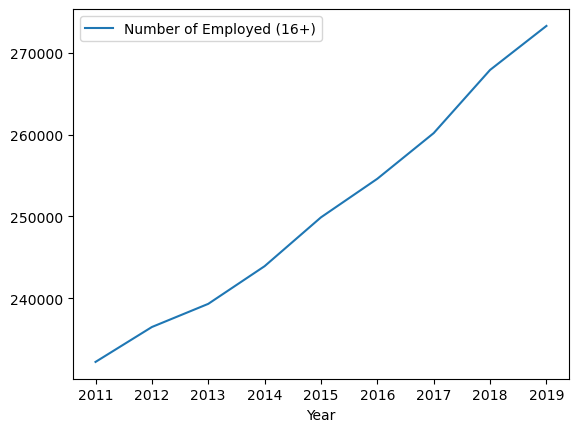
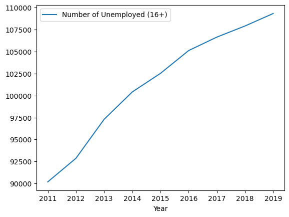
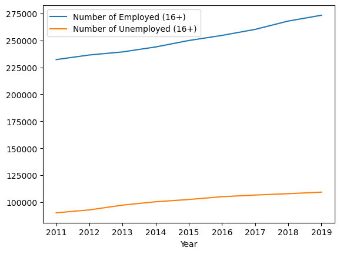

## Employment Observation:
Is there a correlation between median household income and per capita income?

The analysis aimed to investigate whether there exists a correlation between median household income and per capita income. To conduct this analysis, data was gathered from the U.S. Census, focusing on the "Median Household Income" and "Per Capita Income" over a specified time period. The data was then processed by grouping and averaging the median household income and per capita income by year, allowing for a comparative analysis of income trends.

Upon analyzing the data, it was observed that there is indeed a correlation between median household income and per capita income. The visualizations of the data depicted a positive relationship between these two variables, where periods of higher median household income were associated with higher per capita income, and vice versa. This correlation underscores the interplay between household income levels and individual income within a population. It suggests that as household incomes rise, there is a tendency for individual incomes to also increase, reflecting overall economic prosperity and well-being. These findings are essential for understanding income distribution patterns and socioeconomic trends, providing valuable insights for policymakers, economists, and social researchers in addressing income inequality and improving economic opportunities for individuals and households.

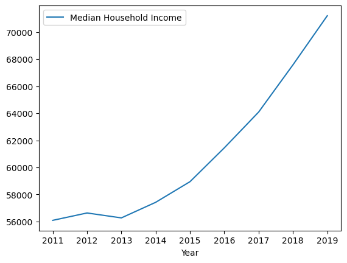
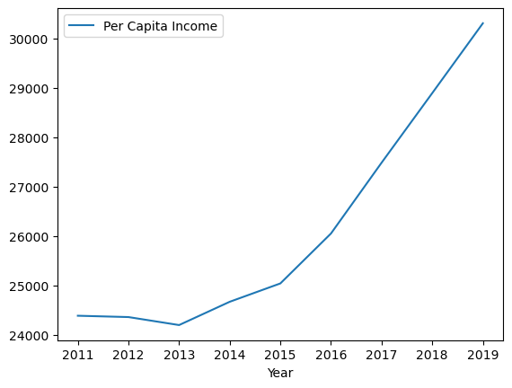
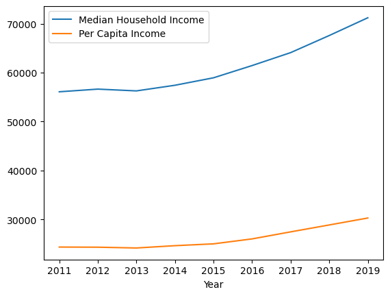

## Observation 5

## Summary of findings

## Problems Encountered

Poverty

Housing:

* An issue identified in the U.S. Census data pertained to the year 2020. Initially attributing the negative integer to data errors, it was later revealed that the anomaly stemmed from the pandemic's impact on data collection during that period.

Income

Homelessness

## Conclusion and Future Considerations
## Authors

Michael Bolens, Beau Dunavant IV, Robb Stenman

## Data

----------------------------

### Is the supply of available beds for the homeless population keeping up with the number of homeless individuals?

One of the most visible signs of poverty is homelessness. We looked at the Point in Time Count (PIT), which is an actual count of homeless people on a single night each January. We compared this to the Housing Inventory Count (HIC), which is a count of beds provided through agencies and non-profits to the homeless. The Department of Housing and Urban Development is responsible for creating the definitions of who qualifies and compiling the data.

The data has two anomalies. First, in Colorado, the methodology for how to count homeless changed between 2012 and 2013. This caused the reported number of homeless to drop from 16,768 in 2012 to 9,754 in 2013. This was not an actual decrease in the number of homeless, just a change in how the count was done. The second anomaly was in 2021. The PIT count took place in January, and this was at the height of the Covid pandemic. The data suggests that there were more beds available than homeless people. However, the reality is that the PIT Count underrepresented the homeless population.

A third possible anomaly is the 2023 PIT Count. At this point, it is not clear what caused the number to increase from 10,397 to 14,439. It could be a one-year exception, or it could be the new normal.

When analyzing the overall data set, a concerning trend emerges there are not enough beds available to accommodate the current homeless population. The fluctuations in both the PIT Count and HIC data make it difficult to identify a clear trend, but the underlying issue remains: the need for housing and support services for the homeless population exceeds the current capacity.

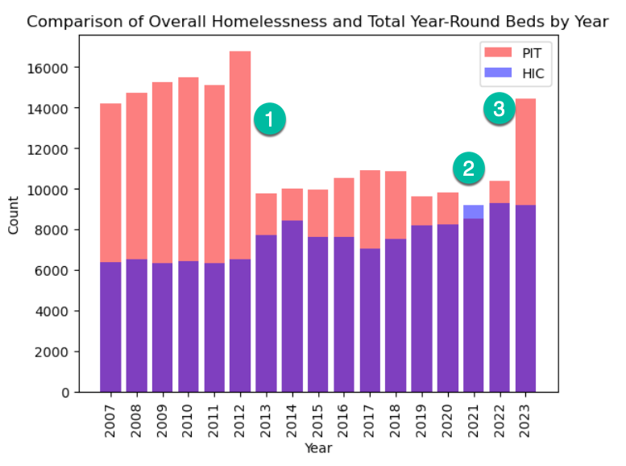 

### How does Colorado’s Self-Sufficiency Standard compare with the Federal Poverty Level?

The Self-Sufficiency Standard (SSS) and the Federal Poverty Level (FPL) are two different approaches to measuring the cost of living and determining poverty thresholds.

The SSS was developed by the Center for Women’s Welfare at the University of Washington. It considers a variety of cost factors, such as housing, childcare, healthcare, transportation, food, and other necessities to determine a “living wage” for different geographic areas and family sizes.  This provides a much better picture of what is necessary to meet people’s basic needs based on where they live.

The FPL is determined by the US Census Bureau and is used by several federal agencies to determine eligibility for benefits. The FPL is an amount that is the same across the lower 48 states. It does account for family size, but not for regional cost differences. The SSS is calculated every 4 years while the FPL is calculated annually.

We were curious how the SSS compared to the FPL in Colorado. We looked at the SSS data for 4 people (2 adults and 2 school-age) vs the FPL for 4 people. Across the data sets, the SSS amount was over twice as much as the FPL for Colorado. More concerning is that the gap between the SSS and FPL is widening over time. This means that people living in Colorado will be disadvantaged when receiving government aid based on a formula that only looks at FPL.

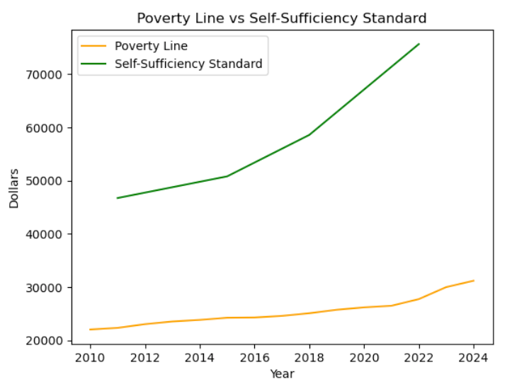 

### Has the number of SNAP recipients increased steadily over time?

The Supplemental Nutrition Assistance Program (SNAP), formerly known as Food Stamps, is a federal program that provides low-income households with Electronic Benefit Cards (EBT) to purchase food. We thought data on the monthly SNAP recipients would provide a good indicator of the number of people struggling with food insecurity.

From 2010 to 2013, the number of SNAP recipients in Colorado was increasing, potentially as a consequence of the 2008 financial crisis. However, from 2013 to 2020 the number of SNAP recipients in Colorado fell significantly. From a high of 513,483 recipients in March of 2013 to 431,397 recipients in February 2020.

Then Covid happened. The data becomes more ambiguous after this point and continues to be difficult to understand through June 2022, when our data set ends. There are 3 spikes in the number of recipients: July 2020, August 2021, and December 2121, where the number of monthly recipients exceeded 550,000. It is unclear to us what caused these spikes.

Given the number of people who appear to be struggling with food insecurity, we thought the time-series data would have shown a steady increase in SNAP recipients. However, the opposite was true. SNAP recipients were decreasing until Covid. It is unclear at this point if the number of recipients will remain elevated or if it will return to pre-Covid levels.

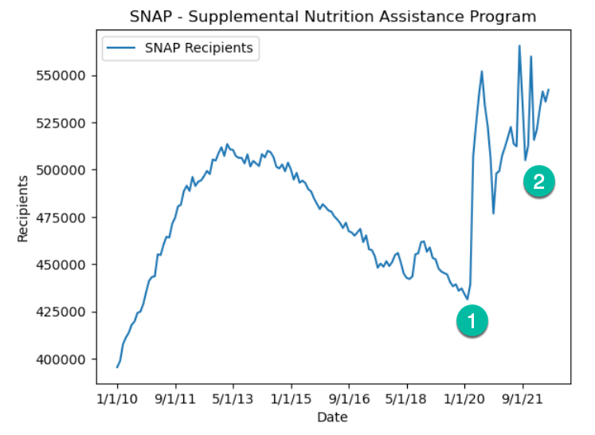 

### Do the income levels and cost of living differ between large, populous counties and smaller, less populated counties?

We started by looking at per capita income for the five largest and five smallest counties in Colorado. In 2012, the per capita incomes were comparable. However, from 2011 to 2017 incomes in the smallest counties were trending downwards, while the largest counties saw their per capita income increasing steadily. In 2017, the small counties’ income started rising, but not at the same rate as large counties. In 2021, the average per capita income in the largest counties was $43,218 while the smallest counties’ average was $33,648, a difference of $9,750.

We also looked at per capita income compared against the Self-Sufficiency Standard (SSS). In the five largest counties, the SSS is increasing relative to per capita income. However, in the five smallest counties, the SSS appears to be closing the gap with per capita income. This could be a concerning trend if it continues.

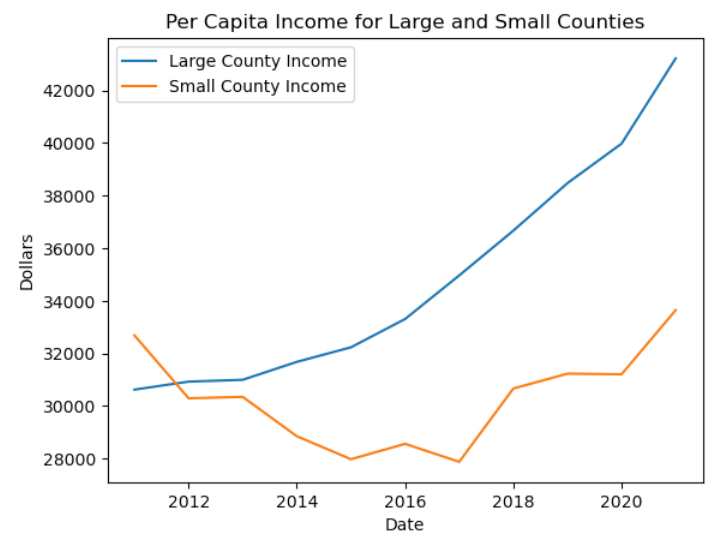 
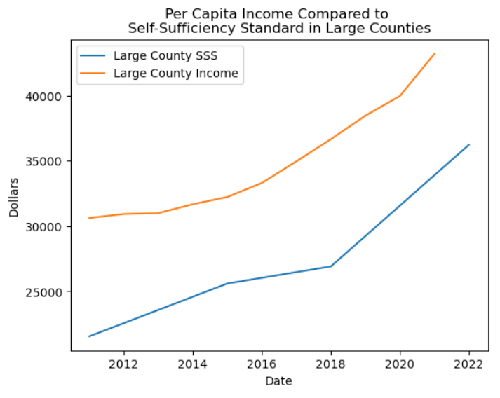 
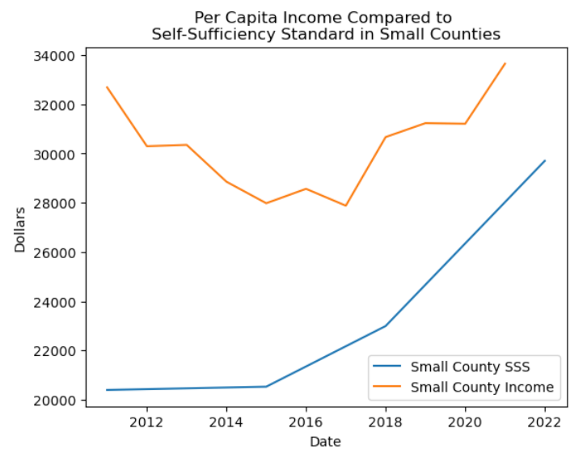 

## Data Challenges

There were four major challenges we faced with the date:

1.     Covid - The biggest challenge in analyzing the data was the presence of anomalies caused by the Covid pandemic. The PIT Count data for 2021 showed more beds available than homeless, which we know is not accurate. The SNAP data had unexplained peaks during Covid. This Covid era data will cause data analysis issues for years to come.
2.     Understanding Data Collection Methodologies – It took time to research the methodology for gathering each data set. There are different definitions for each variable, and it is important to understand the method and purpose of data collection.
3.     Changes to Methodologies – When a major change is made to the method or definition it can significantly affect the data. If one did not know there was a change in method, one could easily draw the wrong conclusion.
4.     Granularity or Amount of Detail – It was surprising how much detail was included in some data sets. One source we considered had over 400 fields of data to categorize types of housing.

## Summary/Conclusion

We saw two different stories in our data sets. Before 2020, most indicators were moving in a positive direction. Incomes were rising, employment was increasing, rent was stable, and SNAP recipients were decreasing. However, the Covid pandemic changed that outlook. We don’t have up-to-date data for all areas, but where the data is available, it shows that the poorer populations need more help.

It will be interesting in the coming years to revisit this data to see if the challenges caused by Covid are permanent or only temporary.

## Future Considerations
There is an abundance of data sets dealing with poverty, income, housing, homelessness, and employment. We would recommend limiting the data sets to one type of data. This would allow for a deeper investigation into the data. We would also recommend focusing on one or two counties. We used different data sets with overlapping date ranges. This caused some comparisons to be lacking as we did not have complete data for all years. 

It would be beneficial to look at both private sources of data along with government-provided data.

## Help is Available
One encouraging thing we learned from this exercise is that help is available. Several organizations are dedicated to helping the poor. Here are some representative organizations and government departments.

Hunger Free Colorado
2 1 1 Colorado
Colorado Coalition for the Homeless
Colorado Department of Human Services
Colorado Department of Local Affairs

## Data Sources
[Center for Women’s Welfare at the University of Washington](https://selfsufficiencystandard.org/colorado/)

[Colorado Department of Education - Homeless Education Data](https://www.cde.state.co.us/studentsupport/homeless_data)

[Federal Reserve Economic Data (FRED)](https://fred.stlouisfed.org/series/BRCO08M647NCEN)
Economic Research - Federal Reserve Bank of St. Louis

[HUD Exchange](https://www.hudexchange.info/resource/3031/pit-and-hic-data-since-2007/)

[US Census Data](https://www.census.gov/en.html)

## Additional Research Sources

[Colorado Coalition for the Homeless](https://www.coloradocoalition.org/sites/default/files/2024-01/2023%20StateOfHomelessness_CCH_F_0.pdf)

[Colorado Department of Human Services](https://cdhs.colorado.gov/snap)

[Hunger Free Colorado](https://hungerfreecolorado.org/)

[Urban Institute](https://www.urban.org/sites/default/files/publication/25626/412613-SNAP-s-Role-in-the-Great-Recession-and-Beyond.PDF)

[9News](https://www.9news.com/article/news/colorados-homeless-population-is-increasing-so-why-does-this-hud-report-say-otherwise/73-497483910)

